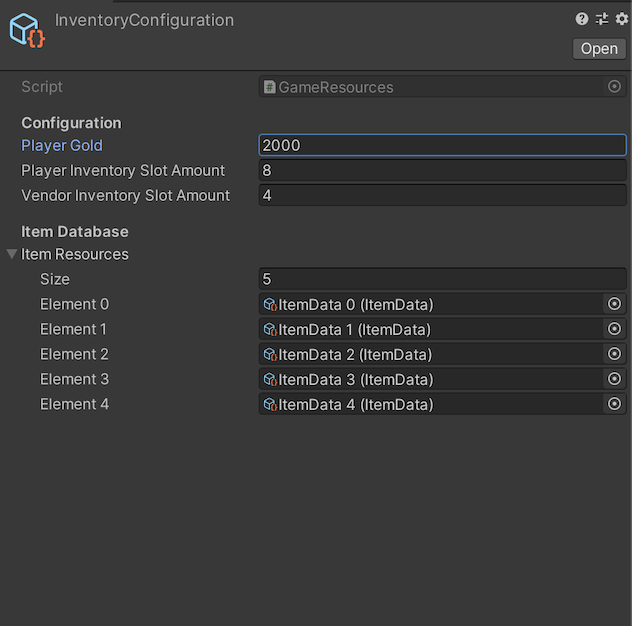

This is a concept project to build a drag and drop inventory system in unity using with unity ui components.

Implemented so far:
- Drag and drop slots
- Easy configuration with a scriptableobject file
- Tooltip
- Swap slots
- Stacable items
- Vendor

Todo features:
- Right click buy and sell
- Buy and sell stackable items by amount
