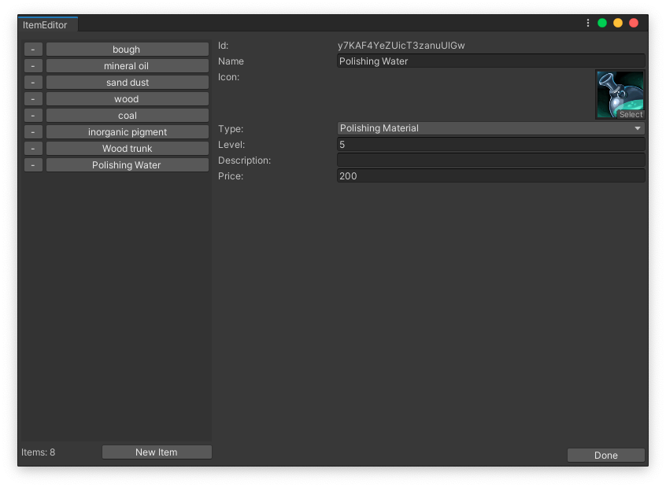

This is a concept project to build a drag and drop inventory system in unity using with unity ui components.
I used `Signals` for listening and emitting events.

https://github.com/cemuka/SignalSystem

Added a database editor tool to define new items.

Implemented so far:
- Item database and editor tool
- Drag and drop slots
- Stacking items
- Tooltip 
- Tooltip checking borders
- Swap slots
- Vendor
- Right click sell

Todo features:
- Buy and sell stackable items by amount
